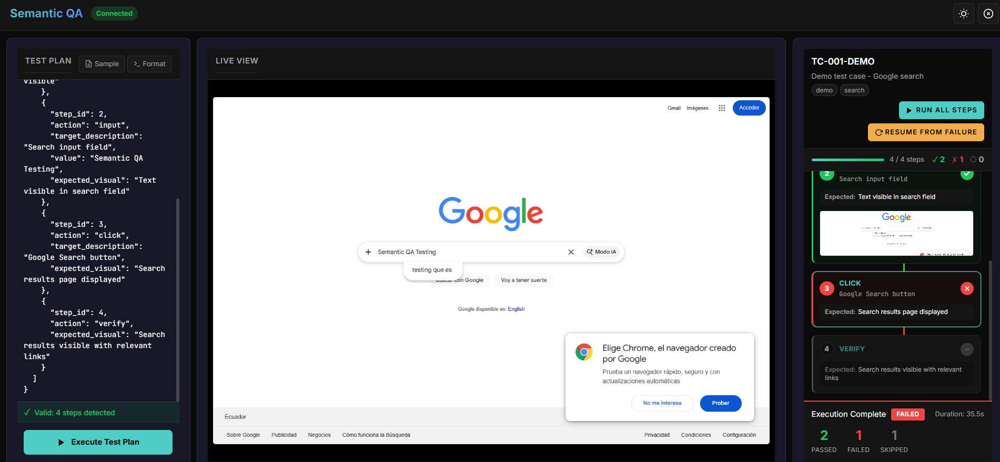

<div align="center">

# Semantic QA

### AI-Powered Autonomous Testing Framework

[](https://python.org)
[](https://vuejs.org)
[](https://fastapi.tiangolo.com)
[](https://ai.google.dev)
[](https://pinecone.io)

*A next-generation QA automation platform that executes test cases using visual understanding and semantic intent — no CSS selectors, no coordinates, no fragile scripts.*

</div>

---

## Overview



**Semantic QA** is an enterprise-grade autonomous testing framework that fundamentally reimagines how automated testing works. Instead of relying on brittle selectors and pixel coordinates, it uses **Google Gemini 2.5 Vision** to understand screens the way a human QA engineer would — visually and semantically.

### The Problem We Solve

Traditional test automation breaks when:
- UI layouts change slightly
- CSS class names are refactored
- Element IDs are modified
- Responsive designs shift elements

**Semantic QA eliminates these problems** by targeting elements based on what they *look like* and what they *mean*, not where they are in the DOM.

---

## Key Features

### Vision-Based Test Execution
Execute human-readable JSON test plans where each step describes **what to do** and **what to expect visually**, not *how* to find elements.

```json
{
  "test_case_id": "TC-001-DEMO",
  "description": "Demo test case - Google search",
  "steps": [
    {
      "step_id": 1,
      "action": "navigate",
      "target": "https://google.com",
      "expected_visual": "Google homepage with search box visible"
    },
    {
      "step_id": 2,
      "action": "input",
      "target_description": "Search input field",
      "value": "Semantic QA Testing",
      "expected_visual": "Text visible in search field"
    }
  ]
}
```

### Real-Time Visual Feedback
- **Live View**: Watch the AI navigate and interact with your application in real-time
- **Step-by-Step Results**: Immediate pass/fail feedback with visual evidence
- **Screenshot Capture**: Automatic evidence collection for every action

### Intelligent Workflow Memory
The system learns from successful executions and stores them in a vector database for:
- **Similar task recognition**: Automatically suggests relevant past workflows
- **Execution optimization**: Learns the most efficient paths
- **Knowledge accumulation**: Builds organizational testing intelligence

### Enterprise Integration
- **Hammer File Integration**: Direct API integration with Graphite Connect
- **Google OAuth**: Secure authentication with domain restrictions
- **Prometheus Metrics**: Full observability with `/metrics` endpoint
- **WebSocket Real-Time**: Sub-second UI updates during execution

---

## Architecture

```
┌─────────────────────────────────────────────────────────────────────────────┐
│                              SEMANTIC QA PLATFORM                           │
├─────────────────────────────────────────────────────────────────────────────┤
│                                                                             │
│  ┌─────────────────┐     WebSocket      ┌─────────────────────────────┐    │
│  │                 │◄──────────────────►│                             │    │
│  │   Vue.js 3 UI   │                    │     FastAPI Backend         │    │
│  │                 │     REST API       │                             │    │
│  │  • Live View    │◄──────────────────►│  • SemanticQAAgent          │    │
│  │  • Test Plans   │                    │  • ComputerUseAgent         │    │
│  │  • Chat Panel   │                    │  • Goal Decomposer          │    │
│  │  • Step Cards   │                    │  • Workflow Memory          │    │
│  │                 │                    │                             │    │
│  └─────────────────┘                    └──────────┬──────────────────┘    │
│                                                    │                        │
│                                    ┌───────────────┼───────────────┐        │
│                                    │               │               │        │
│                                    ▼               ▼               ▼        │
│                            ┌─────────────┐ ┌─────────────┐ ┌─────────────┐  │
│                            │   Gemini    │ │  Pinecone   │ │  Playwright │  │
│                            │   2.5 AI    │ │  Vector DB  │ │   Browser   │  │
│                            │             │ │             │ │             │  │
│                            │ • Vision    │ │ • Workflows │ │ • Actions   │  │
│                            │ • Verify    │ │ • Hammer    │ │ • Screenshots│ │
│                            │ • Locate    │ │ • Success   │ │ • State     │  │
│                            └─────────────┘ └─────────────┘ └─────────────┘  │
│                                                                             │
└─────────────────────────────────────────────────────────────────────────────┘
```

---

## Technology Stack

### Backend
| Technology | Purpose |
|------------|---------|
| **Python 3.10+** | Core runtime |
| **FastAPI** | High-performance async API framework |
| **LangGraph** | Agent state management and workflow orchestration |
| **Playwright** | Browser automation with full CDP support |
| **Pinecone** | Vector database for semantic search and workflow memory |
| **Google Gemini 2.5** | Vision AI for element location and visual verification |
| **Pydantic** | Data validation and settings management |
| **Prometheus** | Metrics and observability |

### Frontend
| Technology | Purpose |
|------------|---------|
| **Vue.js 3.5** | Reactive UI framework with Composition API |
| **Vite 7** | Next-generation frontend build tool |
| **Tailwind CSS 4** | Utility-first CSS framework |
| **Pinia** | State management for Vue |
| **Three.js** | 3D background effects |
| **Lucide** | Beautiful icon library |

### AI/ML
| Technology | Purpose |
|------------|---------|
| **Gemini 2.5 Computer Use** | Multimodal AI for screen understanding |
| **Gemini Embeddings** | 1536-dimension vectors for semantic search |
| **RAG (Retrieval-Augmented Generation)** | Context-aware responses from Hammer data |

---

## Getting Started

### Prerequisites

- Python 3.10+
- Node.js 18+
- Google Gemini API Key
- Pinecone API Key

### Installation

#### 1. Clone & Setup Environment

```bash
git clone <repository-url>
cd testing-agent

# Create Python virtual environment
python -m venv venv
source venv/bin/activate  # Linux/Mac
# or
.\venv\Scripts\activate   # Windows

# Install Python dependencies
pip install -r requirements.txt
```

#### 2. Configure Environment Variables

```bash
cp .env.example .env
```

Edit `.env` with your credentials:

```env
GOOGLE_API_KEY=your-gemini-api-key
PINECONE_API_KEY=your-pinecone-api-key
PINECONE_ENV=gcp-starter
PINECONE_INDEX_NAME=hammer-index
```

#### 3. Install Frontend Dependencies

```bash
cd agent-ui
npm install
```

### Running the Application

**Terminal 1 — Backend:**
```bash
cd agent-backend
python main.py
```

**Terminal 2 — Frontend:**
```bash
cd agent-ui
npm run dev
```

**Access the application:** [http://localhost:5173](http://localhost:5173)

---

## Usage

### Semantic QA Mode (Test Plan Execution)

1. Navigate to the **Semantic QA** view
2. Write or paste a JSON test plan in the left panel
3. Click **Execute Test Plan** or **Run All Steps**
4. Watch the Live View as the AI executes each step
5. Review pass/fail results with visual evidence

### Training Mode (Browser Automation)

1. Type a natural language goal (e.g., "Go to google.com and search for AI testing")
2. The agent will:
   - Decompose complex goals into subtasks
   - Search for similar past workflows
   - Execute actions with visual verification
3. Save successful workflows for future reuse

### RAG Chat (Hammer Data)

```bash
python chat_cli.py
```

Query your Hammer configuration data using natural language.

---

## API Endpoints

| Endpoint | Method | Description |
|----------|--------|-------------|
| `/health` | GET | Health check |
| `/ws/agent` | WebSocket | Real-time agent control |
| `/ws/test-plan` | WebSocket | Semantic QA execution |
| `/test-plans/validate` | POST | Validate test plan structure |
| `/test-plans/execute` | POST | Execute test plan (HTTP) |
| `/workflows` | GET | List saved workflows |
| `/workflows/save` | POST | Save workflow to Pinecone |
| `/hammer/download` | POST | Download & index Hammer file |
| `/metrics` | GET | Prometheus metrics |

---

## Testing

```bash
pytest tests/ -v
```

---

## Project Structure

```
testing-agent/
├── agent-backend/           # FastAPI backend
│   ├── main.py             # Application entry point
│   ├── agent.py            # ComputerUseAgent (browser automation)
│   ├── semantic_qa_agent.py # SemanticQAAgent (vision-based testing)
│   ├── browser.py          # Playwright browser controller
│   ├── core/
│   │   ├── step_executor.py    # Individual step execution
│   │   ├── test_plan_parser.py # JSON test plan parsing
│   │   └── vision_verifier.py  # Visual verification with Gemini
│   ├── goal_decomposer.py  # Multi-task decomposition
│   ├── pinecone_service.py # Vector database operations
│   └── models.py           # Pydantic data models
├── agent-ui/               # Vue.js frontend
│   └── src/
│       ├── views/
│       │   ├── SemanticQAView.vue  # Test plan execution UI
│       │   └── AgentView.vue       # Training mode UI
│       └── components/
│           ├── LiveView.vue        # Real-time browser view
│           ├── TestPlanPanel.vue   # Test plan editor
│           └── StepCard.vue        # Step result display
├── src/                    # Core library
│   ├── agents/             # RAG and librarian agents
│   ├── ingestion/          # Excel/Hammer parsing
│   └── database/           # Vector store abstractions
├── tests/                  # Test suite
└── doc/                    # Documentation assets
```

---

## Contributing

1. Fork the repository
2. Create a feature branch (`git checkout -b feature/amazing-feature`)
3. Commit your changes (`git commit -m 'Add amazing feature'`)
4. Push to the branch (`git push origin feature/amazing-feature`)
5. Open a Pull Request

---

## License

Proprietary — Graphite Connect

---

<div align="center">

**Built with vision, powered by AI**

*Transforming QA automation through semantic understanding*

</div>
